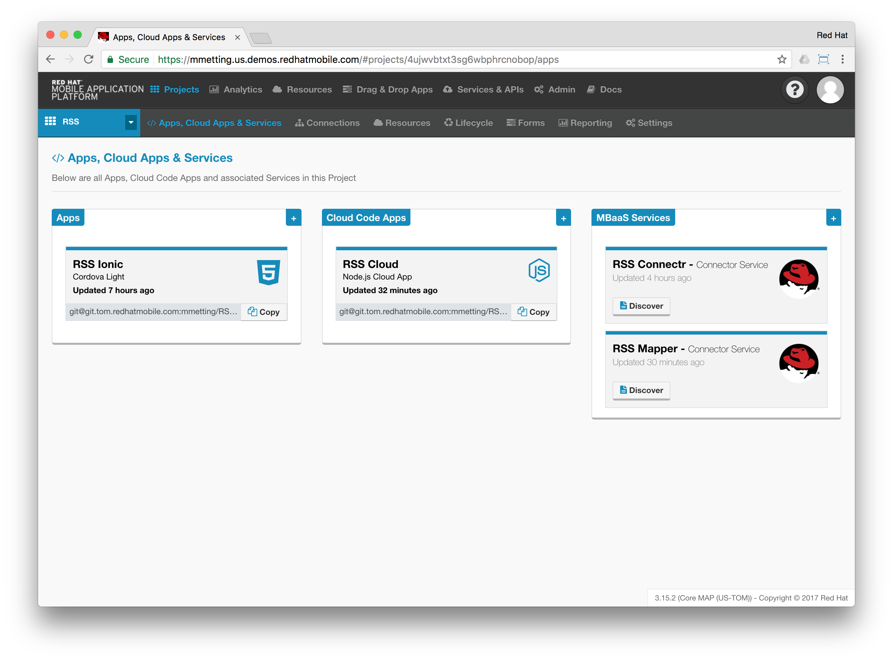

# RHMAP-Demo-Apps
## RHMAP-RSS-Reader-Demo
This is a [demo project](https://github.com/mmetting/RHMAP-RSS-Reader-Demo) utilising various capabilities of the Red Hat Mobile Application Platform. It consists of two client apps (iOS and Ionic) to show RSS feeds from the internet. The RSS feeds are offered by an API within a Cloud Application on Red Hat Mobile. Since feeds are usually exposed as XML-structured data, the feed is transformed and mobile-optimised by means within RHMAP: e.g. the usage of Node modules and the new API-Mapper capability.

## RHMAP-Forms-Submission-Viewer-Demo
This is a [demo project](https://github.com/torbjorndahlen/formsdemo) that uses the '$fh.forms' API to retrieve content submitted through an RHMAP Forms App. It consists of a web app that displays a list of submissions, using '$fh.forms.getSubmissions' from the Cloud App. When selecting a submission the '$fh.forms.getSubmission' is used to retrieve submitted content. The content is examined for the presence of a photo, in which case the '$fh.forms.getSubmissionFile' function is used with the groupId of the photo.

## RHMAP-Chat-Demo
This is a [demo project](https://github.com/torbjorndahlen/kollegornaserver) that uses the $fh.sync API to create a simple chat application.

## RHMAP-BPM-Integration Using Sync
To get regular updates on changes made in tasks and processes in Red Hat JBoss BPM, the $fh.sync framework can be used together
with the [fh-connector-bpm](https://github.com/sebastianfaulhaber/fh-connector-bpm).
Using the '$fh.sync.globalInterceptRequest' function a 'globalRequestInterceptor' that calls the connector on each sync and then stores the result in a MongoDB Collection allows the client app to retrieve the lastest BPM process and task updates.
The following code example shows the 'globalRequestInterceptor':

'''
var $fh = require('fh-mbaas-api');

var globalRequestInterceptor = function(dataset_id, params, cb) {
  // This function will intercept all sync requests.
  // It is useful for checking client identities and
  // for validating authentication

  console.log('Intercepting request for dataset', dataset_id, 'with params', params);

  $fh.service({
    "guid": "guid to connector",
    "path": "/bpm/runtimeTaskQuery",
    "method": "POST",
    "headers": {
      "Content-Type" : "application/json"
    },
    "params": {
      "params": {"username": "BPM username", "password": "BPM password"}
    }
    }, function(err, body, response) {
      if ( err ) {
        console.log('service call failed - err : ' + err);
      } else {
        var options = {
          "act": "update",
          "type": "Name of collection",
          "guid": "GUID of document",
          "fields": {"Field name in document": JSON.stringify(body)}
        };
        fh.db(options, function (err, data) {
          if (err) {
            console.error("Error " + err);
          } else {
            console.log("Updated document with BPM data");
          }
        });
      }
    });

  // Return a non null response to cause the sync request to fail.
  // This (string) response will be returned to the client, so
  // don't leak any security information.
  return cb(null);
}

$fh.sync.globalInterceptRequest(globalRequestInterceptor);
'''

Note that all updates must be made to the same document.
With this, the client app can use the document name as dataset Id and subscribe to updates in BPM.
